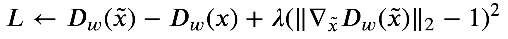

<h1 align="center">Yo! I am Aneesh Aparajit G</h1>

<h3 align="center">Interested in anything relating Machine Learning and Deep Learning.</h3>
- 🔭 Working on **Machine Learning and Deep Learning.**

- 🌱 I’m currently learning **Federated Learning, Deep Learning and Machine Learning.**

- 💬 Ask me about **Deep Learning, Machine Learning and GANs!!**

- 📫 How to reach me **aneeshaparajit.g2002@gmail.com**

- 📄 Know about my experiences [Here!](https://drive.google.com/file/d/1oe1CLUlUai-VqRDFOA8FTtVXRmHdYGhN/view?usp=sharing)

- ⚡ Fun fact **I am interested in cricket and music.**

<h3 align="left">Connect with me:</h3>

